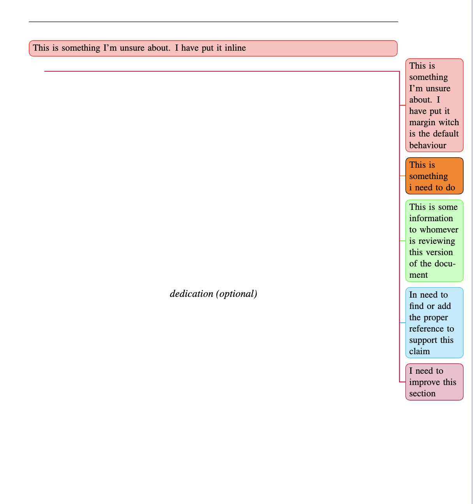

# LaTex tips og triks

## TODOs

```latex
\usepackage[colorinlistoftodos,prependcaption,textsize=small]{todonotes}  % <- Todo active
%\usepackage[disable]{todonotes} % <- Todo disabled


% Todo commands
\newcommandx{\unsure}[2][1=]{\todo[linecolor=red,backgroundcolor=red!25,bordercolor=red,#1]{#2}}
\newcommandx{\change}[2][1=]{\todo[linecolor=blue,backgroundcolor=blue!25,bordercolor=blue,#1]{#2}}
\newcommandx{\info}[2][1=]{\todo[linecolor=green,backgroundcolor=green!25,bordercolor=green,#1]{#2}}
\newcommandx{\litterature}[2][1=]{\todo[linecolor=cyan,backgroundcolor=cyan!25,bordercolor=cyan,#1]{#2}}
\newcommandx{\improvement}[2][1=]{\todo[linecolor=purple,backgroundcolor=purple!25,bordercolor=purple,#1]{#2}}
```

It can be used like this:

```latex
\unsure[inline]{This is something I'm unsure about. I have put it inline}
\unsure{This is something I'm unsure about. I have put it margin witch is the default behaviour}
\todo{This is something i need to do}
\info{This is some information to whomever is reviewing this version of the document}
\litterature{In need to find or add the proper reference to support this claim}
\improvement{I need to improve this section}

```

and will look like this:
