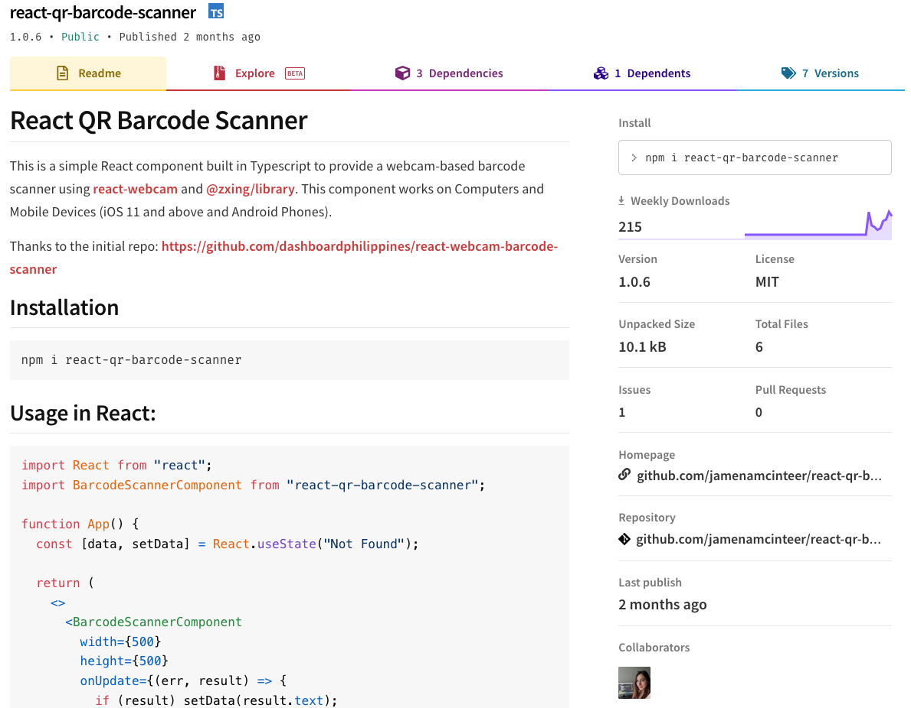
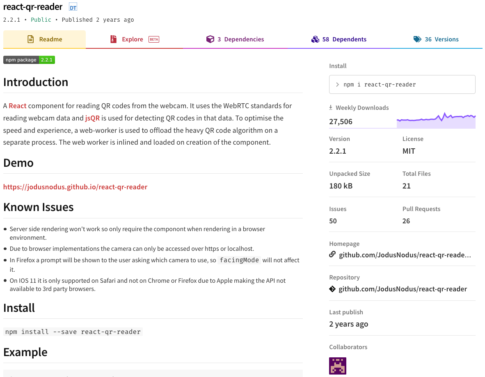
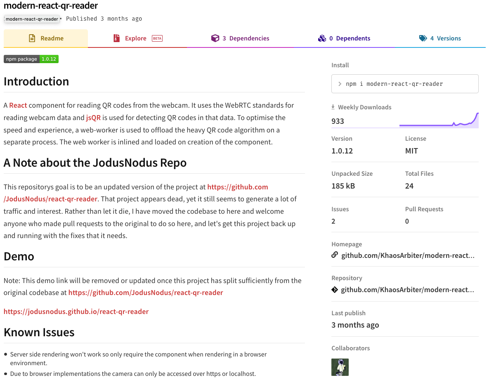
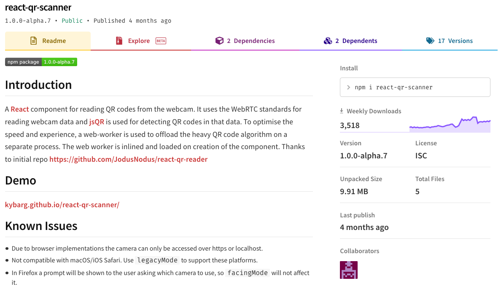

# Om bruk av arbeide med åpen kildekode i kommersielle prosjekter

Left shark, left pad

## Når skal vi bruke biblioteker og rammeverk?
- Har vi løst dette tidligere? Har vi alt et bibliotek for dette?
- Hvor stort er problemet?
- Vil det koste oss mer å løse dette selv, eller koster det mer å prøve å ta ibruk andres kode?
- Vil det være nyttig for oss å ha kontroll på denne koden?
- Vil kode vi skrive passe bedre med det vi alt har i prosjektet?

## Hvilke biblioteker og rammeverk vil vi bruke?
- Hvor mange bruker den?
- Når ble det oppdatert sist?
- Er det i beta eller er det ferdig
- Er det mange issues?
- Har den mange dependencies?
- Hvilken lisens er den under?
- Er det flere vedlikeholdere?

Dette biblioteket har få avhengigheter. Få som bruker det og er bare noen måneder gammelt. Det ble oppdatert for 2 måneder siden og det er en som bidrar til det. Det bygger på et av de mest brukte bibliotekene for QR koder som er godt vedlikehold. Dette virker som et lovende alternativ. Det er lite og virker enkelt. Det er et par known issues og prosjektet er tett knyttet til en enkelt person.

Dette biblioteket er mye brukt. Men det er lenge siden det ble oppdatert og det er mange issues. Det ser ikke ut som det er vedlikeholdt. Så hvis issuene som er beskrevet er dealbreakers så er ikke dette et godt alternativ.

Jeg passer på å gå inn på resposotory til prosjektet. Jeg vil se hvor gammelt det er. Det er fra 2018, har 2 stykk som har bidrat til prosjektet, og siste versjon kom for 3 måneder siden. Lisensen er MIT så det er bra. De har en liste med kjente utfordringer. Den viser til react-qr-reader og peker til at det biblioteket ikke er vedlikeholdt. Det er få som bruker det, men siden det startet som en fork fra et bibliotek som er mye brukt ser jeg på det som et lovende alternativ.

Dette er også en fork av react-qr-reader for å prøve å løse noen av problemene. Den er mer brukt enn de andre forkene. Men er i alpha. Ut fra releaseloggen ser det ut til å bli oppdatert i rykk og napp. Det virker ikke som et lovene alternativ.

## Hvordan tar vi ibruk biblioteker og rammeverk?